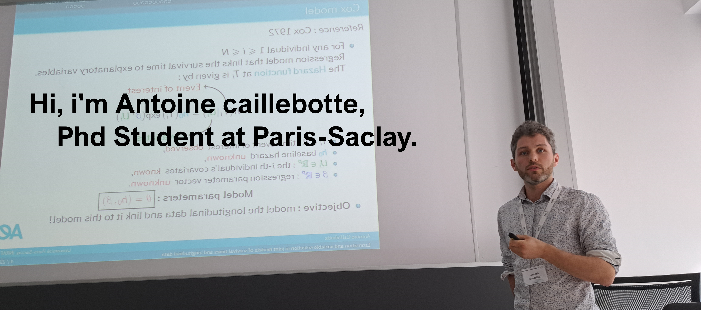
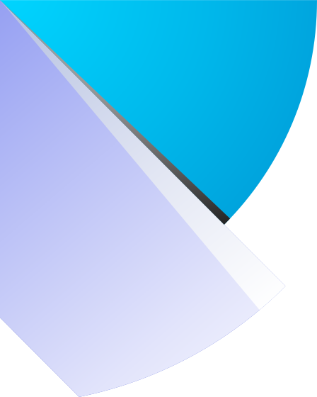

  
  
  
  

## 🖇️ Connect with me 

  
  
  </a>
  
  

## ✨About me 

Since october 2022, I'm a  PhD student supervised by [Estelle kuhn](https://genome.jouy.inra.fr/~ekuhn/), [Sarah Lemler](https://sites.google.com/view/sarah-lemler/accueil?authuser=0) and [Judith Legrand](https://moulon.inrae.fr/personnes/jlegrand/). I work at INRAE in the GQE-LeMoulon (Gif-sur-Yvette) and MaIAGE (Jouy-en-Josas) units. 

I am working on the selection of high-dimensional variables in statistics with applications in the biological field.

- 🔬 I’m currently working at [INRAE](https://www.inrae.fr/) in Jouy-en-Josas, France.
- 🏃‍♂️Outside of work I take part in running and trail races

## 🛠 Some of the tools I use

<table>
<tr>
  <td align="center">
      
       
      git
  </td>
  <td align="center">
    
     
    python
  </td>
  <td align="center">
    
     
    poetry
  </td>
  <td align="center">
    
     
    vscode
  </td>
<tr>
  <td align="center">
    
     
    numpy
  </td>
  <td align="center">
    
     
    R
  </td>
  <td align="center">
    
     
    C++
  </td>
  <td align="center">
    
     
    SDL
  </td>
</tr>
